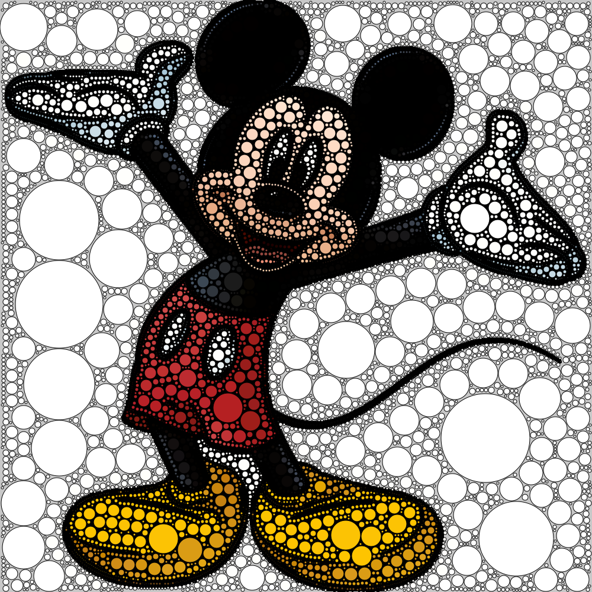
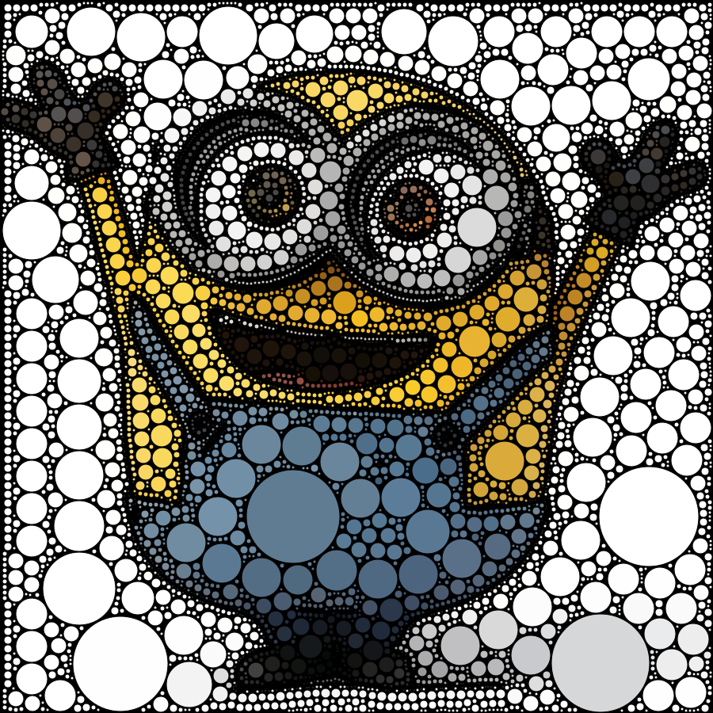
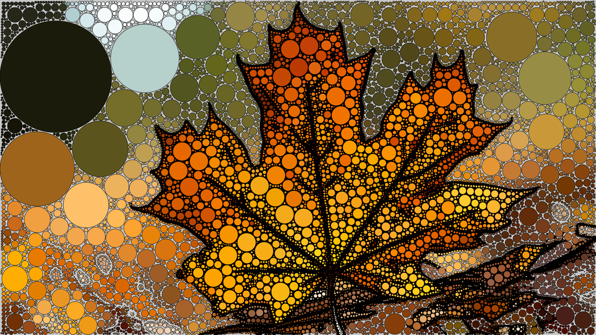

# Digital Circlism
It is a modern artistic expression in which paintings are made with digital tools usually featuring celebrities made of thousands of flat circles on a black background.
# Project Overview
Using traditional method for circlism is time consuming but using algorithms we can save that time.
This project consists of a algorithmic artwork. It is designed to apply digital circlism to images within 5 minutes or less depending upon image resolution.

These are some outputs of our project.







## Steps for Project accomplishment:

1. Input Image
2. Image Segmentation using Mean Shift Filtering
3. Canny Edge Detection
4. Some Image Filtering to reduce noise
5. Euclidean Distance Transform of each pixel
6. Background Separation 
7. Closed Circle Packing with Circles of different denominations

## Algorithm for Circle Packing:
Deciding set of denomiations to get circles of variable denomination.Let this be stored in set D in decending order.
```
bool isOccupied[n][m]={false} // where n and m are the size of the image and initialise all pixel to false
## Input image = I;
for each radius in D:
  for each pixel in I:
    if EDT(p) >= radius && isOccupied[pixel] == False:
      C = Circle(center=p, radius=EDT(p)
      if isOccupied[each pixel within the circle range] == False:
      
        ## set each pixel in range of circle to True in order to overcome overlapping condition
        isOccupied[for all points in C] = True
        DrawCircle(C)
```
Worst-case complexity for this algorithm is O(n²k), where n is total number of pixels constituting the image and k is the size of denomination set.

## Tools used
- Jupyter
- OpenCV
- PyCairo

## Steps to run the code
1. Take an input image
2. Apply Mean-Shift-Segmentation by running the `Maincpp.cpp` file in `MSS` folder providing the image input and save path
```
g++ Maincpp.cpp `pkg-config --cflags --libs opencv`  // compile the file
./a.out "input_path" "save_path"                     // run the file
```
3. Run background subtraction.
Use `background subtractor.ipynb` file to separate background from the input image.
4. Apply Circlism Algorithm.
Use `circlism.ipynb` to compute circles corresponding to the image, and generate the image.

## Reference
This solution is a little modification of algorithmic-art proposed by <b>Sourav De</b> and <b>Partha Bhowmick</b> in 9th International Symposium on Visual Computing as mentioned [here](http://cse.iitkgp.ac.in/~pb/research/circlism/).
